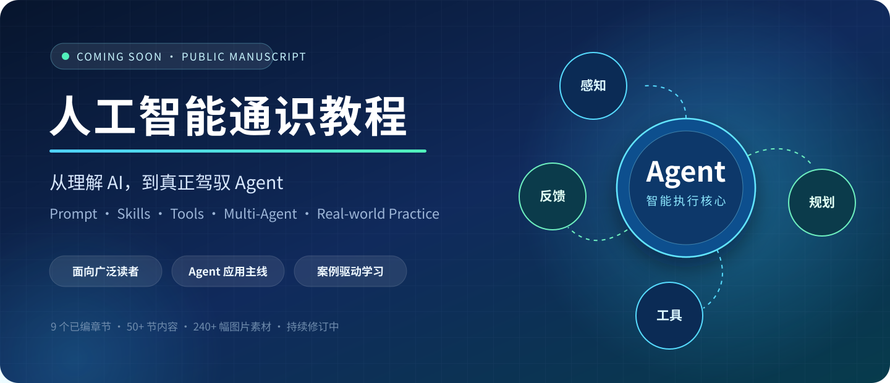
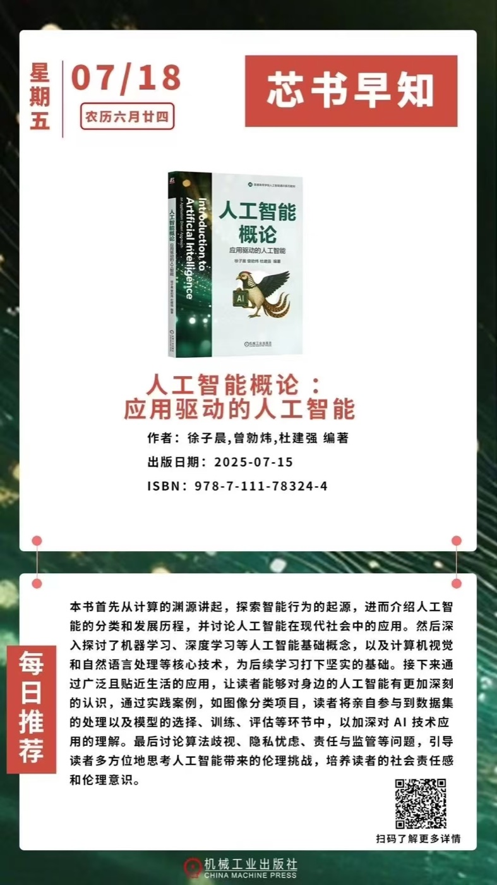
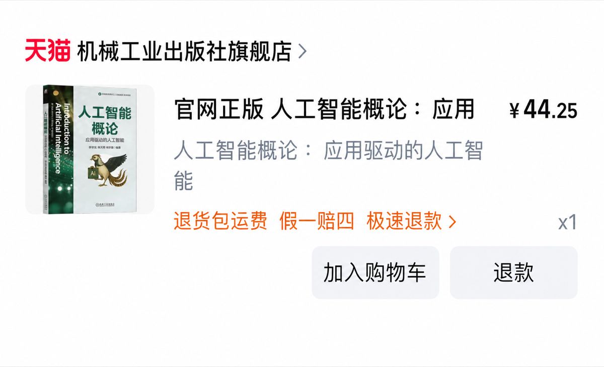
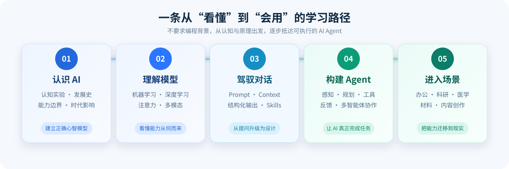
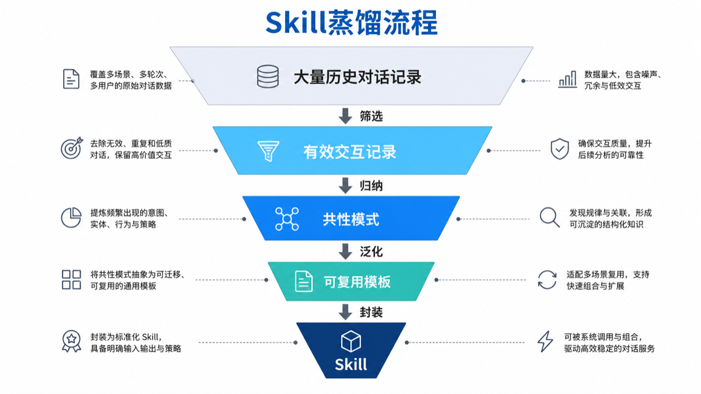
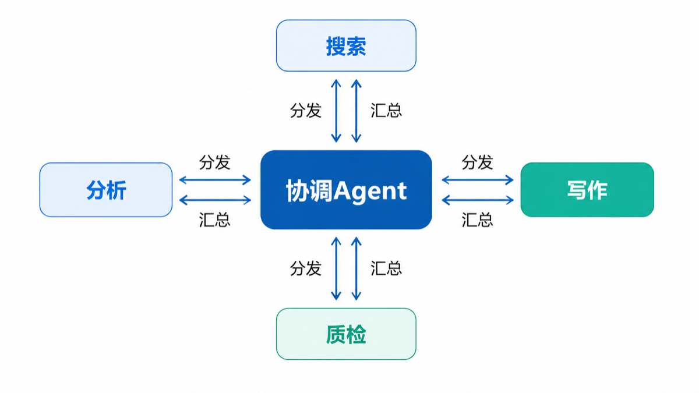

<p align="center">
  
</p>

<h1 align="center">人工智能通识教程（第二版）</h1>

<p align="center">
  <strong>一本写给广泛读者的、关于当下 AI Agent 应用的通识教程。</strong><br>
  不要求编程背景，从 AI 的认知逻辑出发，带你一路走到 Prompt、Skills、工具调用、智能体协作与跨领域实践。
</p>

<p align="center">
  <code>中文教材</code> · <code>AI Agent</code> · <code>案例驱动</code> · <code>XeLaTeX</code> · <code>持续修订</code>
</p>

> [!IMPORTANT]
> **📚 新书即将上市，敬请期待！** 本仓库对应的《人工智能通识教程（第二版）》正在进行出版前的持续修订。欢迎 Star 或 Watch 本仓库，关注书稿与出版动态。

> **本仓库是什么？** 它不是一份只罗列热门名词的速查表，也不是只写给算法工程师的技术手册。它试图用普通读者能够进入的语言，解释 AI 为什么有效、哪里会失效，以及如何把一次对话逐步升级成可规划、会调用工具、能根据反馈调整的 Agent 工作流。

## 从《人工智能概论》走向 Agent 时代

本书是在 2025 年出版的《人工智能概论：应用驱动的人工智能》基础上形成的新版：既是一次面向 **AI Agent** 的系统升级，也是一次面向真实专业场景的**领域化拓展**。

- **Agent 化升级**：从人工智能基础与单轮生成，进一步走向 Prompt、上下文管理、Skill 蒸馏、任务规划、工具调用、反馈闭环与多智能体协作。
- **领域化升级**：在通识应用和科研工作流之外，深入医学、医工融合与材料科学等场景，讨论数据、证据、专业边界与人工复核。
- **教学体验升级**：延续前作“应用驱动”的思路，用更多问题导入、步骤图解、完整案例、习题和风险提示帮助普通读者真正上手。

<table>
  <tr>
    <td width="42%" align="center" valign="top">
      <br>
      <sub>2025 年出版的前作《人工智能概论：应用驱动的人工智能》</sub>
    </td>
    <td width="58%" align="center" valign="middle">
      <br>
      <sub>前作现已在机械工业出版社旗舰店上架</sub>
    </td>
  </tr>
</table>

### 前作购买与配套资源

- **正版图书购买**：[淘宝 · 机械工业出版社旗舰店](https://item.taobao.com/item.htm?ali_refid=a3_430582_1006%3A2749384094%3AH%3AlRz6SuiRPTDPlTcZHs1VGUCy5rjL5ndE%3Ae267fdb0ea4fe2661133e741c284ba14&ali_trackid=282_e267fdb0ea4fe2661133e741c284ba14&id=1067141988036&mi_id=0000pDIJYIyvQKLBc79P2vZrenR2aVBwBhR363gdomt0VAI&mm_sceneid=1_0_9275845400_0&spm=a21n57.1.hoverItem.1&utparam=%7B%22aplus_abtest%22%3A%225aeaec1958d4726d92948443d9961e91%22%7D&xxc=ad_ztc)
- **配套数字平台**：[人工智能概论数字教学平台](https://szjc.ncu.edu.cn/) — 仅面向南昌大学及获得本书官方授权学校的师生开放；账号通常为对应学号，实际权限以学校或平台通知为准。
- **配套开发项目**：[Nanqipro/Introduction-to-Artificial-Intelligence](https://github.com/Nanqipro/Introduction-to-Artificial-Intelligence)

## 为什么值得读

- **从原理走向行动**：先建立 AI 的正确心智模型，再进入 Prompt、Skill 蒸馏、任务规划、工具调用和多智能体协作，避免只会“背咒语式提问”。
- **面向广泛读者**：用认知实验、生活故事、图解和类比拆解机器学习、深度学习、注意力机制与生成式模型，不以代码能力作为阅读门槛。
- **把 Agent 放进真实世界**：案例横跨求职与办公、内容创作、科研、医学和材料科学，关注 AI 如何进入完整流程，而不只展示一次性的回答。
- **正视边界与责任**：持续讨论幻觉、数据偏见、隐私、权限、人工复核和专业责任，让“会用 AI”同时意味着“知道何时不能盲信 AI”。
- **可继续生长的开放书稿**：正文采用 LaTeX 维护，章节、插图和样式均在仓库中，适合阅读、教学讨论、勘误与协作修订。

## 一条从“看懂”到“会用”的路径

<p align="center">
  
</p>

读完核心内容，你应当能够回答这些问题：

1. AI 为什么看起来“会理解”，它真正学到的又是什么？
2. 为什么同一个任务，提示方式不同会产生完全不同的结果？
3. 如何把一次成功对话沉淀为可复用的 Skill？
4. Agent 如何感知任务、制定计划、选择工具并形成反馈闭环？
5. 多个 Agent 如何分工协作，又该怎样限制权限、保护数据与保留人工控制？
6. 如何把这些方法迁移到学习、工作、科研、医疗和材料发现等真实场景？

## 内容地图

当前书稿已形成 9 个正文篇章，主要覆盖以下内容。章节编号沿用全书编排；第 6—8 章仍在修订规划中，因此源码中保留了相应位置。

| 学习阶段 | 当前章节 | 你将探索的核心内容 |
| --- | --- | --- |
| 建立 AI 认知 | 第 1 章 · 智能认知演进与时代变革 | 认知实验、AI 发展史、能力边界、产业应用、前沿与治理 |
| 看懂模型能力 | 第 2 章 · AI 认知世界的核心能力 | 机器学习、深度学习、卷积网络、注意力、生成式模型与世界模型 |
| 驾驭 Agent | 第 3 章 · 提示词工程与智能体系统 | Prompt 文法、上下文、结构化输出、Skill 蒸馏、规划执行闭环、多智能体与安全 |
| 通识应用实践 | 第 4 章 · 人工智能通识应用 | 简历与信件、办公写作、创意影像、平台内容与多端适配 |
| 科研工作流 | 第 5 章 · AI 赋能科研 | 领域导航、文献检索、课题设计、论文写作、审稿、翻译与多模态表达 |
| 医学与医工融合 | 第 9—10 章 | 医学数据、影像诊断、临床决策、医嘱审核、智能穿戴、康复与中医药知识图谱 |
| 材料智能 | 第 11—12 章 | 材料数据与表示、性能预测、知识嵌入、主动学习、生成设计与可信验证 |

每一部分都尽量采用“问题导入 → 知识要点 → 图解/案例 → 方法边界 → 小结与习题”的教学结构。目前仓库包含 **50+ 节内容、200+ 个小节、90+ 个正式图示位置和 240+ 幅图片素材**。

## 从对话到智能体：书中图解一览

<table>
  <tr>
    <td width="50%" align="center">
      <br>
      <sub><strong>Skill 蒸馏</strong>：把高价值交互提炼为可复用、可组合的能力模块</sub>
    </td>
    <td width="50%" align="center">
      <br>
      <sub><strong>多智能体协作</strong>：由协调 Agent 分发任务、汇总结果并组织质量检查</sub>
    </td>
  </tr>
</table>

> 正文插图由作者借助 AI 工具绘制或整理，用于辅助解释概念、结构与流程；正式使用时仍应结合上下文理解，不应把示意图当作未经核验的事实证据。

## 适合谁读

- 想系统理解 AI Agent、但不想从高等数学或大型代码项目起步的读者；
- 正在把 AI 用于学习、写作、办公、内容创作或个人知识管理的实践者；
- 希望为学生建立完整 AI 素养框架的教师与课程设计者；
- 想把大模型纳入科研流程、同时关注证据与学术规范的研究者；
- 对医疗、材料等专业场景中的 AI 应用与责任边界感兴趣的跨学科读者。

## 仓库结构

```text
.
├── main.tex                       # 全书编译入口
├── package.tex                    # 全局宏包、样式与自定义环境
├── title.tex / preface.tex        # 封面与前言
├── chapter_1.tex ...              # 通识、原理、Agent 与应用章节
├── chapter_materials.tex          # 材料科学微模块
├── images*/                       # 各章节插图与界面示例
├── docs/readme-assets/            # README 专用图片（不与正文素材混放）
└── attachment.tex                 # 随书附件的扩展入口
```

## 本地编译

### 环境要求

- 一套完整的 TeX 发行版，例如 TeX Live 或 MacTeX；
- XeLaTeX 与 `ctex` 中文排版支持；
- 建议使用 `latexmk` 管理多轮编译。

### 生成 PDF

```bash
latexmk -xelatex -interaction=nonstopmode -file-line-error main.tex
```

生成的 `main.pdf` 与 LaTeX 中间文件已加入 `.gitignore`。建议把正式 PDF 作为 GitHub Release 附件发布，保持源码仓库整洁。

清理编译缓存：

```bash
latexmk -c
```

> 当前版本已通过静态文件引用检查：正文引用的 148 个去重图片路径均存在。由于不同系统的 TeX 发行版与中文字体环境可能不同，如遇排版或编译问题，欢迎在 Issues 中附上系统、TeX 版本和完整错误信息。

## 如何参与

这是一份持续修订中的书稿。非常欢迎以下形式的帮助：

- 报告错别字、图号/章节号错误、失效引用或排版问题；
- 指出过时、含糊或可能误导的 AI 技术表述；
- 建议更贴近普通读者的类比、案例与练习；
- 补充 Agent、Skills、工具调用、多智能体协作的真实应用线索；
- 从教育、科研、医疗、材料等专业视角审视案例边界。

提交反馈时，请尽量写明“文件名 + 章节/段落 + 问题 + 建议修改”。你可以通过 [GitHub Issues](https://github.com/Nanqipro/AI_Book_Revision_2026/issues) 发起讨论。

## 阅读与使用提醒

- AI 工具、产品能力与行业数据变化很快，书中涉及的版本、参数和案例应以阅读时的最新可靠来源为准。
- 书中的 AI 输出示例用于教学，不代表模型生成内容天然正确；事实、数字、引文和参考文献必须回到原始来源核验。
- 医疗与材料科学章节用于通识教育和方法讨论，不构成医疗建议、临床结论、实验安全保证或专业决策替代。
- 将真实资料交给第三方 AI 前，应先处理个人信息、未公开研究数据、商业秘密与其他敏感内容。

## 项目状态与许可

本项目处于**第二版持续修订阶段**。部分前言、作者信息、预留章节和配套附件仍待完善，内容与结构可能继续调整。

本仓库目前尚未附带开源许可证。在许可证明确之前，公开可见不等于放弃著作权或自动授权复制、改编与商业使用；如需超出 GitHub 正常浏览、讨论与勘误范围使用本项目，请先取得作者许可。

---

<p align="center">
  如果这本书让你第一次真正看懂了 Agent，欢迎点亮 ⭐，也欢迎把你的疑问变成下一版里更好的解释。
</p>
